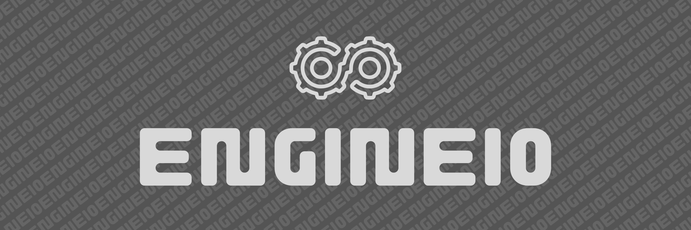

[godoclink]: https://godoc.org/github.com/sarvalabs/go-moi-engineio
[latestrelease]: https://github.com/sarvalabs/go-moi-engineio/releases/latest
[issueslink]: https://github.com/sarvalabs/go-moi-engineio/issues
[pullslink]: https://github.com/sarvalabs/go-moi-engineio/pulls


[][godoclink]
[][latestrelease]


[][issueslink]
[][pullslink]

# EngineIO
**go-moi-engineio** is the official blueprint package for implementing Logic Execution Runtimes that are 
compatible with the MOI Protocol. It describes a set of interfaces that are required to for logic execution.

It generally lacks any concrete implementations except for minor map types or enums. The exception 
to this is the Logic Manifest handling capabilities such as `ReadManifestFile` and `NewManifest`.
In order for `engineio` to successfully decode the manifest elements in the file, the runtime needs 
to registered with the package with the `RegisterRuntime` function.

The `Engine`, `EngineRuntime` interface along with other I/O interfaces such as `CallEncoder`, `CallResult`, 
`ErrorResult` are typically only implemented by execution runtimes such as  [**go-pisa**](https://github.com/sarvalabs/go-pisa) 
(Official PISA VM Implementation)

Driver interfaces such as `Logic`, `IxnDriver`, `CtxDriver`, `EnvDriver` and `CryptoDriver` are implemented
on MOI Protocol implementation such as [**go-moi**](https://github.com/sarvalabs/go-moi) (Official MOI Implementation). 
It also implements identifier types like `LogicID` and `IxnType`.

The `DependencyDriver` interface is usually left to the runtime of choice to implement or import from a supporting
package based on its specific rules of element relationship management. One such available implementation is the 
[**depgraph**](https://github.com/manishmeganathan/depgraph) package which prevents non-circular dependencies.

## Install
Install the latest [release](https://github.com/sarvalabs/go-moi-engineio/releases) using the following command
```sh
go get -u github.com/sarvalabs/go-moi-engineio
```

## Contributing
Unless you explicitly state otherwise, any contribution intentionally submitted
for inclusion in the work by you, as defined in the Apache-2.0 license, shall be
dual licensed as below, without any additional terms or conditions.

## License
&copy; 2023 Sarva Labs Inc. & MOI Protocol Developers.

This project is licensed under either of
- [Apache License, Version 2.0](https://www.apache.org/licenses/LICENSE-2.0) ([`LICENSE-APACHE`](LICENSE-APACHE))
- [MIT license](https://opensource.org/licenses/MIT) ([`LICENSE-MIT`](LICENSE-MIT))

at your option.

The [SPDX](https://spdx.dev) license identifier for this project is `MIT OR Apache-2.0`.